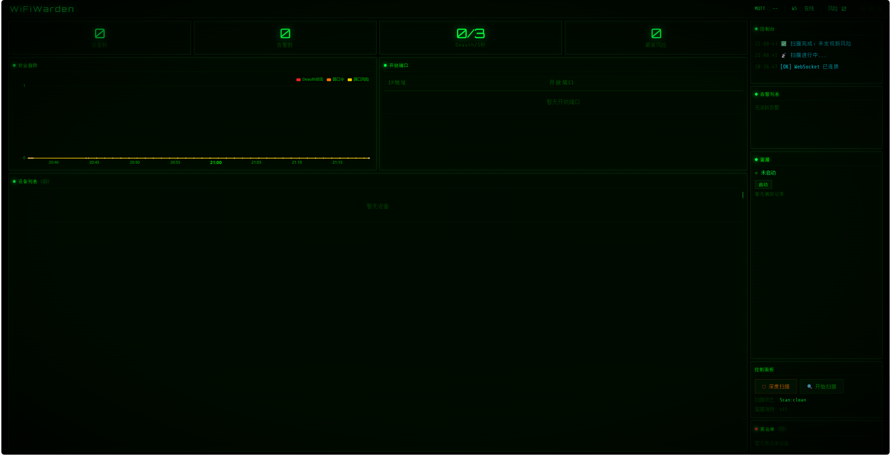

<p align="center">
  <h1 align="center">🛡️ WiFiWarden</h1>
  <p align="center"><strong>无线局域网多源感知与自适应防御系统</strong></p>
  <p align="center">
    
    
    
    
    
  </p>
</p>

<p align="center">
  
</p>

---

## 📖 简介

WiFiWarden 是一套基于 ESP32-S3 双板架构的物联网安全防护系统，融合 **802.11 帧嗅探**、**端口扫描**、**弱口令检测**、**AI 智能分析** 与 **蜜罐诱捕**，实现对无线局域网的全方位威胁感知与自适应防御。

```
        ┌─────────────┐         UART         ┌──────────────┐
        │   AP 板     │◄───────────────────►│   扫描板      │
        │  WiFi 热点   │   HOST / KICK /     │  帧嗅探       │
        │  DHCP / NAT │   UNBLK             │  端口扫描     │
        └──────┬──────┘                      │  弱口令检测   │
               │                              └──────┬───────┘
               │                         MQTT / cJSON  │
               │                              ┌───────┴──────┐
               └──────────────────────────────┤    云端       │
                                              │ FastAPI       │
                                              │ Nginx HTTPS   │
                                              │ AI (DeepSeek) │
                                              │ 蜜罐服务      │
                                              └──────────────┘
```

---

## 🏗️ 项目结构

```
.
├── app/                          # 云端 Web 控制台
│   ├── app.py                    #   主入口 (API + WebSocket)
│   ├── state.py                  #   状态管理 (内存 + JSON 持久化)
│   ├── config.py                 #   配置 (环境变量注入)
│   ├── mqtt_client.py            #   MQTT 客户端
│   ├── ai_agent.py               #   AI 智能体 (DeepSeek)
│   ├── honeypot.py               #   蜜罐服务 (Telnet + HTTP)
│   ├── requirements.txt          #   Python 依赖
│   ├── Dockerfile
│   └── templates/
│       └── index.html            #   前端单页应用 (ECharts)
│
├── nginx/
│   ├── default.conf              #   HTTPS 反向代理配置
│   └── certs/                    #   SSL 证书 (需自行配置)
│
├── mosquitto/
│   └── config/                   #   MQTT Broker 配置文件
│
├── esp32s3/
│   ├── wifiwarden/               #   扫描板固件
│   │   ├── main/
│   │   │   ├── main.c            #       主程序 (~99 KB)
│   │   │   ├── mac_oui.h         #       MAC 厂商识别 (100+)
│   │   │   └── weak_passwords.h  #       弱密码字典 (200+ 组)
│   │   ├── components/
│   │   │   ├── st7789/           #       ST7789 屏幕驱动
│   │   │   └── cjson/            #       JSON 解析库
│   │   └── sdkconfig.defaults    #       编译默认配置
│   │
│   └── wifiwarden_ap/            #   AP 板固件
│       └── main/
│           └── main.c            #       主程序 (~25 KB)
│
├── docs/
│   └── homepage.png              #   控制台截图
│
├── .env.example                  #   环境变量模板
├── docker-compose.yml            #   Docker 服务编排
├── deploy.sh                     #   一键部署脚本
├── PROGRESS.md                   #   开发进度
└── WIRING.md                     #   硬件接线说明
```

---

## 🔧 技术栈

| 层级 | 技术 | 说明 |
|:--:|------|------|
| 🖥️ 云端后端 | **FastAPI + WebSocket** | REST API + 实时推送 |
| 🎨 前端 | **ECharts + 原生 JS** | 单页应用，安全趋势曲线 |
| 📡 消息中间件 | **Mosquitto MQTT** | 设备双向通信 (1883) |
| 🔒 反向代理 | **Nginx** | HTTPS + HTTP/2 + 速率限制 |
| 🤖 AI 引擎 | **DeepSeek API** | 威胁分析与自动防御决策 |
| 🍯 蜜罐 | **Telnet + HTTP** | 双协议诱捕，实时捕获日志 |
| 🎯 端侧 | **ESP32-S3 × 2** | 双板 UART 通信架构 |

---

## ⚡ 功能特性

### 扫描板（ESP32-S3）

- 🔍 802.11 帧嗅探（Probe Request / Beacon / Deauth）
- 🚨 Deauth 攻击实时检测（5 秒滑动窗口，阈值可配）
- 🔌 高危端口扫描（TCP Connect 扫描 11 个端口）
- 🔑 弱口令检测（HTTP Basic Auth + Telnet + FTP，200+ 组密码）
- 🗂️ Web 管理后台路径枚举（30+ 常见路径）
- 🏷️ 设备指纹识别（MAC OUI，100+ 厂商）
- 📊 ST7789 屏幕实时显示状态
- 🔊 蜂鸣器 + LED 声光告警
- ☁️ MQTT 双向通信（实时上报感知数据，接收云端命令）

### AP 板（ESP32-S3）

- 📡 发射 WifiWarden 热点（供设备连入）
- 🌐 NAT/NAPT 网络地址转换（客户端可上网）
- 🔗 UART 桥接扫描板（HOST/KICK/UNBLK 命令）
- 🛡️ MAC 黑名单强制断开（拉黑设备每次连接即踢除）
- 📋 DHCP 服务器（192.168.4.x 网段）

### 云端控制台

- 🖥️ 设备列表实时监控（WebSocket 推送）
- 📈 安全趋势曲线（Deauth / 弱口令 / 端口风险）
- 🍯 蜜罐管理（Telnet + HTTP 双蜜罐，一键启停）
- 🤖 AI 自动分析（检测到威胁自动调用 DeepSeek）
- 🚫 黑名单管理（拉黑/解除，全链路同步到 AP 板）
- 🔔 告警记录与日志
- 🔄 扫描管理（普通/深度扫描）

---

## 🚀 快速部署

```bash
# 1. 准备环境变量
cp .env.example .env         # 编辑 .env 填入真实配置

# 2. 配置 SSL 证书 (参考 nginx/certs/README.md)

# 3. 一键部署
chmod +x deploy.sh && ./deploy.sh
```

> 部署前请确保已修改：
> - `.env` 中的 MQTT 密码和 AI API Key
> - `nginx/default.conf` 中的域名
> - SSL 证书文件

防火墙需开放 **TCP 443** (HTTPS) 和 **TCP 1883** (MQTT)。

---

## 🔥 ESP32 烧录

```bash
# 扫描板
cd esp32s3/wifiwarden
idf.py set-target esp32s3 && idf.py build
idf.py -p COM3 flash monitor

# AP 板
cd esp32s3/wifiwarden_ap
idf.py set-target esp32s3 && idf.py build
idf.py -p COM4 flash monitor
```

> ⚠️ 烧录前修改 `sdkconfig.defaults` 中的 MQTT 地址和 WiFi 密码

---

## ⚡ 上电顺序

> ① AP 板 → 绿灯常亮 → ② 扫描板 → 屏幕 OK → ③ 设备连 WiFi → ④ 浏览器访问

---

## 📊 风险等级

| 等级 | 图标 | 触发条件 | 系统响应 |
|:--:|:--:|----------|----------|
| 0 | 🟢 | 无异常 | 静默记录 |
| 1 | 🔵 | 少量开放端口 | 提升监控频率 |
| 2 | 🟡 | 高危端口开放 | 蜂鸣器短鸣 + LED 快闪 |
| 3 | 🟠 | 弱口令被发现 | 持续告警 + 自动拉黑 |
| 4 | 🔴 | Deauth 攻击活跃 | 长鸣告警 + 自动开蜜罐 |

---

## 📡 MQTT 主题设计

| 主题 | 流向 | 用途 |
|------|:--:|------|
| `wifiwarden/sense/{mac}` | 设备 → 云端 | 感知数据实时上报 |
| `wifiwarden/command/{mac}` | 云端 → 设备 | 专属控制指令 |
| `wifiwarden/command/broadcast` | 云端 → 所有设备 | 广播命令 |
| `wifiwarden/status` | 设备 → 云端 | 在线状态心跳 |
| `wifiwarden/honeypot` | 蜜罐 → 云端 | 攻击捕获日志 |

---

## 📄 License

MIT © 2026
